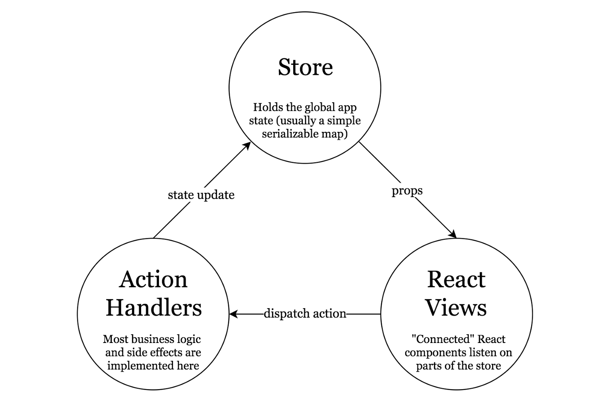

# DHIS2 Client Application
This is a simple, dhis application created in react


# Technical Implementation guide

## Table of content
* Buld process
* Deploy process
* Project structure
* Flux state managment

## Build Process
To build the project, first clone the repository
```
git clone https://github.com/uonafya/dhis-mfl-client.git
```

run the buld command
```
npm start
```
the project will be available at [localhost:8080](http://localhost:8080) 

## Deploying the project
```
npm run build:prod
```
the bundle will be available at the public folder in the root of the project folder. It will also contain the manafest file and the image. 
Zip all the contents of the folder into a new one will you upload to the DHIS APP site
## Project structure
The project is spread accross 4 folders, each with its specific purpose
```
    Componenets: Stateless React componenets. Often at lowest level of implementation

    Containers: Stateful components that are connected to Redux, They invoke actions and receive data

    Services: Classes that make API calls to the endpoints and receive data

    Store: Contain modules that handle business logic for both KMHFL and DHIS2
```
## Flux state management

The store folder contains two domains, Authentication and Orgunits that handle logic and update the application state.
Each of the modules has the following files:
```
    Actions.js: contains the actions that can be dispatched from the User Interface.
    
    ActionTypes.js: define the type of actions that the actions.js can be dispatched.
    
    reducer.js: gets output from actions.js and merges them to the application store.

    selectors.js: contains functions that translate data from the store to a form that the User interface needs
```

functions in authentication actions:
```
    logIn() : login to DHIS2
    mflApiAuth() : gets a token from KMHFL
    setInterval() : renew token  from KMHFL
    mflUserDetails() : get user details from KMHFL
```

functions in Orgunit actions:
```
    getOrgUnits() : fetches orgunits from DHIS2 depending on the level given (county:2, subcounty:3, ward:4...)
    getOrgUnit() : fetches a specific orgunit
        addOrgUnits() : adds the orgunits fetched to the application store

    getFacilities() : fetched orgunits at facility level (5) based on the ward id provided
        addFacilities() : adds the facilities to app store
    
    resolveMflFacility() : for the list of orgunits provided, fetches the mfl facilities by searching by name and code
            updateResolutionResults() : create a summary for the resolution process

    createExcel() : creates an excel file that matches the report table
```

## User Interface
### Pages
The Application is made of two primary pages:
```
Home: holds the form that allows selection of ward to perform resolution
    Components  : OrgunitForm.js
                : OrgunitHighlits.js

FacilityResolutionPage: shows the results of the resolution process
    Components: FacilityResolutionTable.js
```
